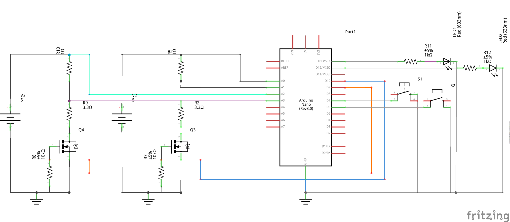

== Battery Capacity Checker

Discharge 2 Li-Ion cells from >4.1V voltage to 2.5V while recording the discharge 
profile and cell capacity. Discharge process can be started by pressing a momentary
push button switch. A red LED lights up to indicate that the discharge process is
still continuing (2.5V cut off has not been reached). 
 
== Circuit:

Schema:

Main component:

50A, 50V, 0.022 Ohm, Logic Level, N-Channel Power MOSFET: http://www.mouser.com/ds/2/149/RFP50N05L-189523.pdf[F50N05L]

Breadboard:

https://goo.gl/photos/qm96asJ2DXB2iUNHA

== Example Result

1500mAh cell:

https://goo.gl/photos/hopcskTPDCRb9MaL8

== Credits:

Single cell circuit and source code from:

YouTube Video: https://www.youtube.com/embed/qtws6VSIoYk

Website: http://AdamWelch.Uk
